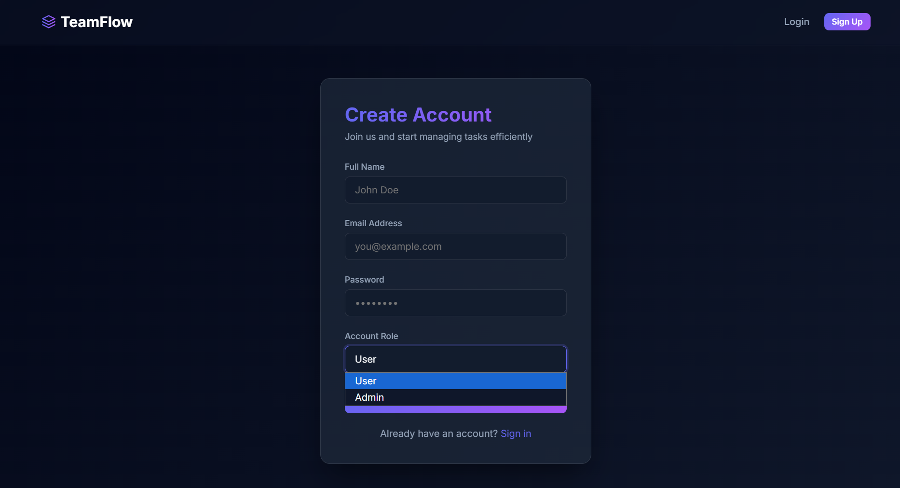
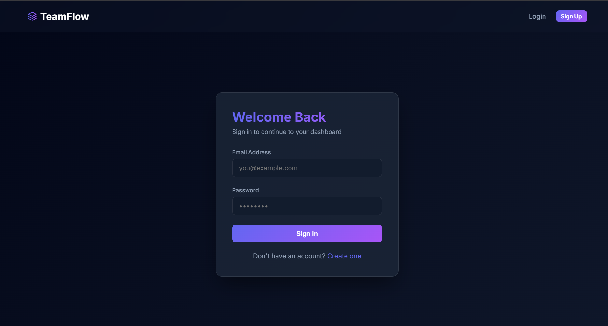
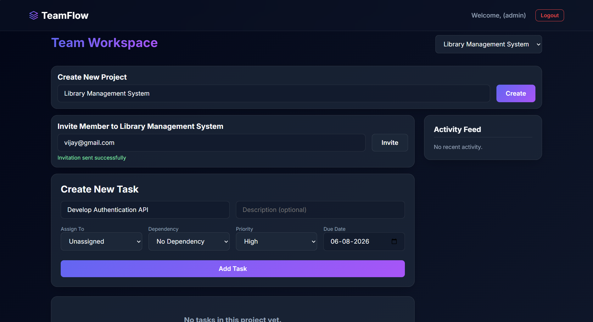
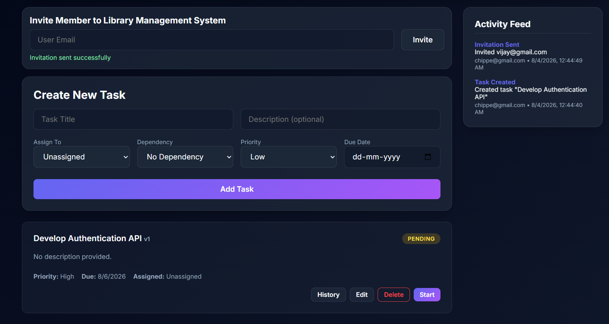
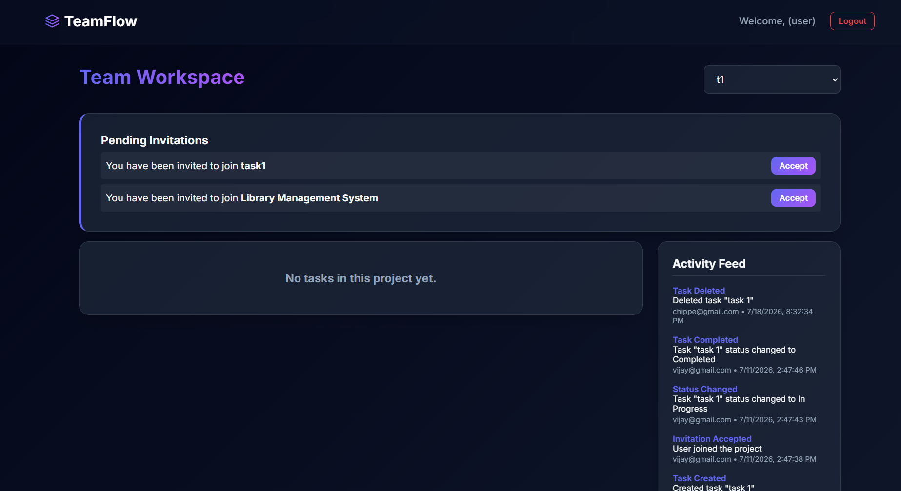

# 🚀 TeamFlow

TeamFlow is a **Full-Stack Team Collaboration Platform** built using the **MERN Stack**. It enables Project Leaders to create projects, invite members, assign tasks, monitor progress, and collaborate through a secure role-based dashboard.

---

# 🎯 Problem Statement

Many students work on team projects during college, but coordinating tasks effectively is often challenging. Tasks are usually assigned through WhatsApp messages, spreadsheets, or verbal discussions, making it difficult to track progress, manage responsibilities, and ensure accountability. As a result, project leaders struggle to organize work efficiently, while team members lack a centralized place to view and update their assigned tasks.

TeamFlow was built to solve this problem by providing a centralized collaboration platform where Project Leaders can create projects, invite team members, assign tasks, set priorities and deadlines, and monitor overall progress. Team Members can securely access their assigned tasks and update their status, enabling better collaboration, transparency, and project management.

---

# 📸 Application Preview

---

# 🔐 Authentication

### Register


### Login


---

# 👑 Team Leader (Admin)

### Dashboard
Create and manage projects from a centralized workspace.



---

### Invite Team Members
Invite users to collaborate on the project.


---

### Create & Manage Tasks
Create tasks, assign priorities, dependencies, and due dates.



---

### Activity Feed
Track all project activities in real time.


---

# 👤 Team Member

### Pending Invitations
Accept project invitations from Team Leaders.


---

### Assigned Tasks
View assigned tasks and update their progress.



---

### Task Version History
View the complete history of task updates and status changes.


---

# ✨ Features

- 🔐 JWT Authentication & RBAC
- 👥 Team Invitation System
- 📁 Project Management
- ✅ Task Assignment & Status Tracking
- 📜 Activity Timeline
- ♻️ Task Version History
- 🎯 Task Priority & Deadlines
- ☁️ Cloud Deployment (Vercel & Render)

---

# 🛠️ Tech Stack

**Frontend**
- React.js
- Vite
- Tailwind CSS
- Axios

**Backend**
- Node.js
- Express.js
- MongoDB
- JWT Authentication
- bcrypt

**Deployment**
- Vercel
- Render

---

# ⚙️ Installation

```bash
git clone https://github.com/vijaygithub25/TeamFlow-mern.git

cd backend
npm install
npm run dev

cd ../frontend
npm install
npm run dev
```

---

# 🔑 Environment Variables

### Backend

```env
MONGO_URI=
JWT_SECRET=
CLIENT_URL=
```

### Frontend

```env
VITE_API_URL=
```

---

# 🌐 Live Demo

**Frontend:** https://team-flow-mern.vercel.app/

---

# 👨‍💻 Author

**Chippe Vijay**

GitHub: https://github.com/vijaygithub25


---

⭐ If you found this project useful, consider giving it a star!
